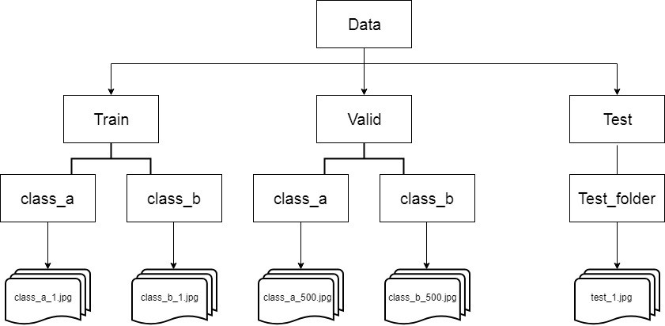

# Image preprocessing scripts
Scripts I use to manipulate data for my machine learning (mainly computer vision) problems.
**Pillow** and **SKLearn** are required dependencies.
# Files
 - **numpy_image_preprocessing**
    - **pricess_images_npy**
    - **open_npy_data**
    - **compute_class_weight**

 - **image_data_generator_splitting**
    - **rearrange_data**

 
 ## numpy_image_preprocessing
 File which contains functions designed to split the images in numpy arrays which are easy to adapt to our ML problem.
 
 The functions present in this file are: 
   - **process_images_npy**
   - **open_npy_data**
   - **compute_class_weight**
   
   ### process_images_npy
    Reads the images and splits them in arrays.
  Arguments :
   - **original_data_path:** Directory from where to read the images.
   - **dir_to_save:** Directory where to store the numpy arrays.
   - **image_resolution:** Tuple containing the height and width in which to store the images.
   - **class_size_limit=None(Optional):** Number of images to read from each class. If not defined, will read all images from all classes.
   - **data_split = 0.9(Optional):** Fraction of images to store in the data array. If not defined, will default to 90%.
   - **grayscale = False:** Either to read images as RGB (3 channels) or grayscale (0 channels). If not define will default to RGB.
   
   ### load_npy_data
    Loads the .npy files stores by process_images_npy
    
   Arguments:
   - **data_dir:** Directory where the arrays are stored.
   
   Returns: 
   - **train_data, train_labels, test_data, test_labels:** 4 arrays where our data is stored according to the array's name.
    
   ###  compute_class_weights
    Wrapper for SKLearn's compute_class_weight which only needs the train labels. Used to balance the training for unbalanced datasets.
   Arguments:
    
   - **train_labels:** The labels of our training data.
    
   Returns:
   - **class_weight_dict:** A dict which shall be fed as an argument to the **keras.fit()** method to tell it to pay more attention to certain classes whcich as underrepresented in our dataset.
    
    
  ##image_data_generator_splitting
 File which contains one function designed to split and rearrange the images' directory in order for it to be in the right structure to be fed to keras' **ImageDataGenerator**.
 
 
 ### rearrange_data
 Responsible for rearranging and image directory to follow the ImageDataGenerator structure.
  
  Arguments:
   - **original_data_path:** Directory from where to read the images.
   - **dir_to_save:** Directory where to create the new structure and store the images 
   - **class_size_limit=None(Optional):** Number of images to read from each class. If not defined, will read all images from all classes.
   - **data_split = 0.9(Optional):** Fraction of images to store in the data array. If not defined, will default to 90%.

The mentioned structure follows the template for N Classes:

>**Dir_to_save**
>>**train/**
>>>.../class1
>>>
>>>.../class2
>>>
>>> (...)
>>>
>>>.../classN
>>>
>> **test/**
>>>.../class1
>>>
>>>.../class2
>>>
>>> (...)
>>>
>>>.../classN
 
The following image further illustrates the structure for a binary classification problem:

